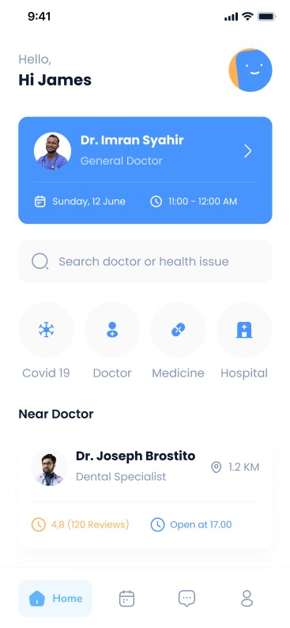
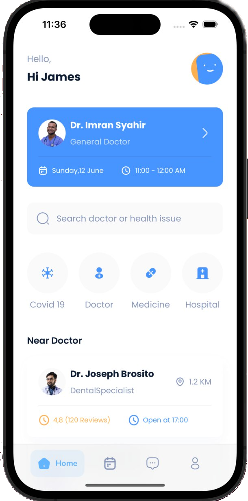
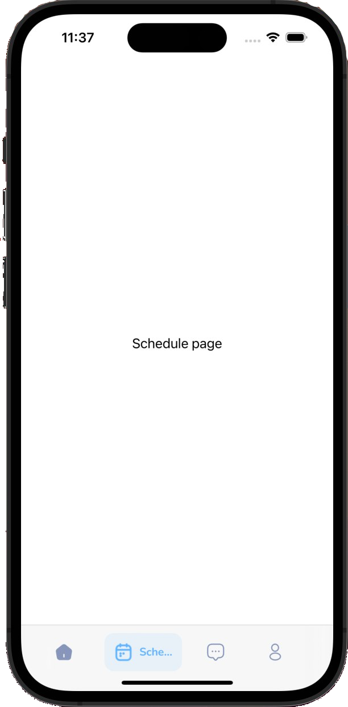
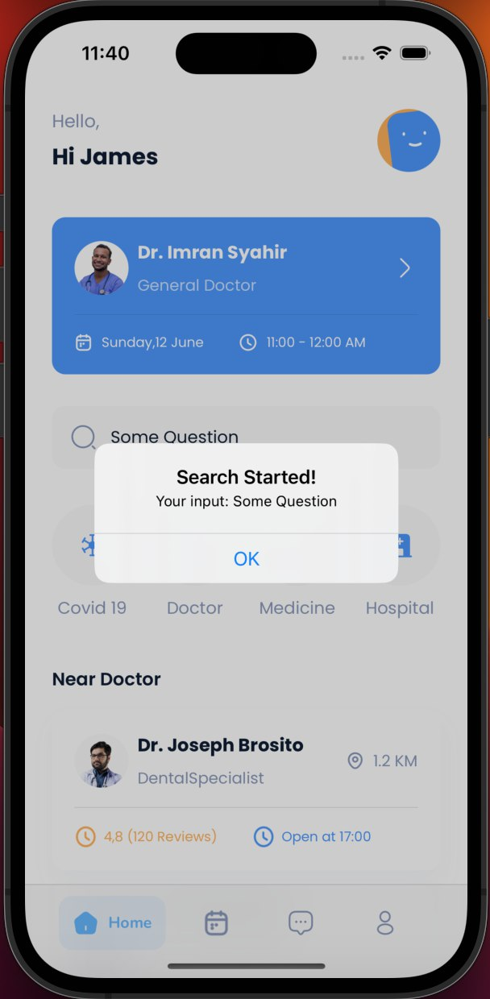

# Описание проекта

   

Данная работа была выполнена в рамках прохождения курса «Профессиональная разработка мобильных приложений» от компании Effective с целью получения первичных навыков в работе с инструментарием пользовательского интерфейса для iOS разработки __SwiftUI__.

Средствами представленной технологии необходимо было реализовать следующий экран:

&NewLine;
В результате работы с помощью инструментов __SwiftUI__ было получено приложение, имеющее вид:
&NewLine;

  

Приложение реализовано в виде 4-х экранов, переход между которыми осуществляется при использовании нижней панели навигации. Основная страница Home сответствует предоставленному макету из условия задания. Остальные страницы содержат Text View, которые их характеризуют.

Строка поиска реализована с помощью представления TextField, где был указан плейсхолдер. При вводе пользователем запроса и при нажатии на кнопку выбрасывается Alert, уведомляющий пользователя о начале поиска.
